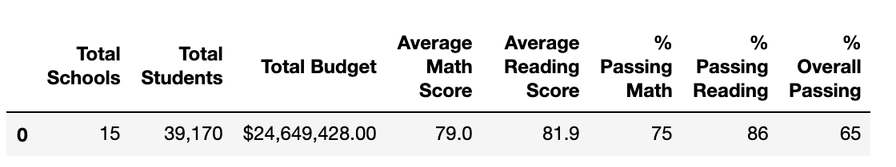

# School_District_Analysis

## Overview of the school district analysis:

### Purpose:

The school board has notified Maria and her supervisor that the students_complete.csv file shows evidence of academic dishonesty in the reading and math grades for Thomas High School ninth-graders appear to be modified. The purpose of this school district analysis was to help Maria and her supervisor replace the math and reading scores for Thomas High School with NaNs while keeping the rest of the data intact. Once the math and reading scores are substituted, we repeat the school district analysis and write a report describing the changes that affected the overall analysis.

By using an open-source distribution software called Anaconda and one of its products, Jupyter Notebook, we are to create documents that contain live code in python. We are to read raw data from CSV files, inspect and clean data, merge datasets, perform mathematical calculations, and visualize the data with charts and graphs to tell a story using the Jupyter Notebook and the Pandas library.

## Resources

Data Source: PyCitySchools.ipynb
Software: Python 3.9, Visual Studio Code 1.50.0, Anaconda 4.8.5, Jupyter Notebook 6.0.3, Pandas

## Results:
Using bulleted lists and images of DataFrames as support, address the following questions.

- How is the district summary affected?

The average math score is 79.0 and reading score 81.9.
The passing math percentage of 75 and passing reading percentage of 86 and overall passing percentage is 65%.

After the clean up,the average math score is 78.9 and reading score 81.9.
The passing math percentage of 73.9 and passing reading percentage of 84.7 and overall passing percentage of 64.1.

- How is the school summary affected?
Thomas High School was rank 2nd with an overall percentage of 90.9.

Thomas High School was rank 8th with an overall percentage of  65.

- How does replacing the ninth graders’ math and reading scores affect Thomas High School’s performance relative to the other schools?

By replacing the ninth graders’ math and reading scores, this affect Thomas High School’s performance and rank.

- How does replacing the ninth-grade scores affect the following:
    
    - Math and reading scores by grade:
   
By replacing the ninth-grade math and reading scores with "nan", this means their score is 0 and the 9th Grade failed. The Student count got redeuced from 1635 to 1174.
   
   - Scores by school spending:
    
The spending range per student for Thomas High School was $630-644. After the clean up, the results stayed the same.
  
Before:

The Student count 
After:

   - Scores by school size   
By removing the ninth-graders, the school size went from 1635 to 1174. The average math score, the percentage of passing math, percentage of passing reading and percentage of  of overall passing was reduced.

   - Scores by school type:
Thomas High School type is Charter school. 
The average percentage of 83.5 and reading score 83.9.
The passing math percentage of 94 and passing reading percentage of 97 and overall passing percentage of 90%.

After the clean up and removing Thomas High School 9th Grade scores, the avergae scores reduced.

The average math score is 83.5 and reading score 83.9.
The passing math percentage of 90 and passing reading percentage of 93 and overall passing percentage is 87%.

## Summary: 

Four major changes in the updated updated school district analysis after removing the reading and math scores for the ninth grade at Thomas High School was the avergae of math and reading scores, overall grades. The student count got reduced.

